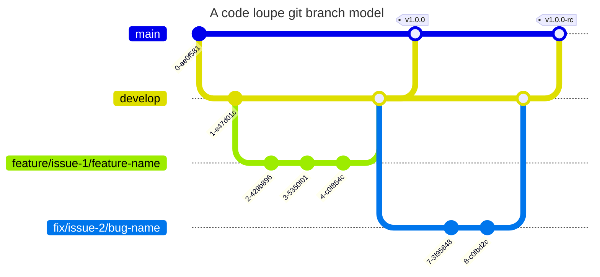

# Code Loupe

Rust のフロントエンドフレームワーク「Yew」を使用した記事サイト

## Git/Github

Git/Github を運用する上でのルール

※ `[]`で囲まれている箇所は括弧ごと置き換えてください !

### コミットログ

| コミットメッセージ                                    | 用途                                                                         |
| ----------------------------------------------------- | ---------------------------------------------------------------------------- |
| `:sparkles: feat: [コミットメッセージ]`               | 新機能の追加                                                                 |
| `:bug: fix: [コミットメッセージ]`                     | バグ修正                                                                     |
| `:recycle: refactor: [コミットメッセージ]`            | リファクタリング・パフォーマンス・可読性向上                                 |
| `:building_construction: chore: [コミットメッセージ]` | その他すべて(ドキュメント作成・デットコードの削除・フォーマット・テストなど) |

以下のようにコミットメッセージのテンプレートを用意しておくと便利です。

```
git config --global commit.template ~/dotfiles/git/template/commit_message
```

`commit_message`ファイル

```sh
# :sparkles: feat:
# :bug: fix:
# :recycle: refactor:
# :building_construction: chore:
```

### ブランチ運用

Git Flow, Github Flow を参考にして考えた Code Lope のブランチモデルで運用します。

| ブランチ名                           | 用途                               | 切り出し元 | マージ先 |
| ------------------------------------ | ---------------------------------- | ---------- | -------- |
| `main`                               | 製品リリース                       | なし       | なし     |
| `develop`                            | 開発                               | main       | main     |
| `feature/issue-[issue番号]/[機能名]` | 新機能追加(テスト・環境構築を含む) | develop    | develop  |
| `fix/issue-[issue番号]/[バグ名]`     | バグ修正(リリース後)               | develop    | develop  |

※ 安全にリリースするために 2 相コミット方式を採用しています。



## 実行環境

```sh
$ cargo --version
cargo 1.67.0 (8ecd4f20a 2023-01-10)

$ rustc -V
rustc 1.67.0 (fc594f156 2023-01-24)

$ rustup -V
rustup 1.25.2 (17db695f1 2023-02-01)

$ rustup show
Default host: x86_64-unknown-linux-gnu
rustup home:  /home/hamadatomoki/.rustup

installed toolchains
--------------------

stable-x86_64-unknown-linux-gnu (default)
nightly-x86_64-unknown-linux-gnu

installed targets for active toolchain
--------------------------------------

wasm32-unknown-unknown
x86_64-unknown-linux-gnu

active toolchain
----------------

stable-x86_64-unknown-linux-gnu (default)
rustc 1.67.0 (fc594f156 2023-01-24)
```

## ドキュメント

ドキュメント類は、プロジェクトルートにある/docs でまとめています

## CI/CD

- Github Actions
